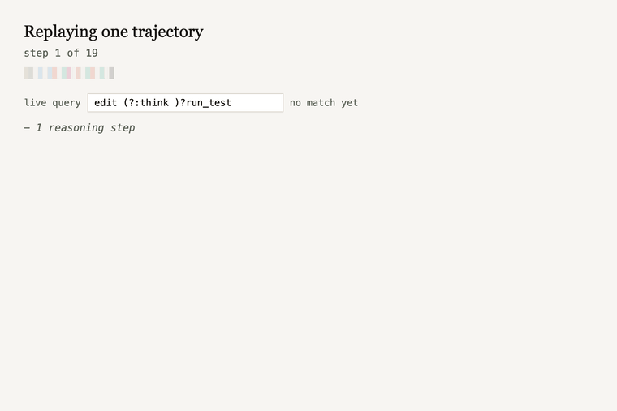

# procgrep

`procgrep` reads agent trace logs and tells you how agents differ in *how they work*, not just whether they passed.

[**Live explorer**](https://midah-procgrep-explorer.hf.space) · [**Interactive essay**](https://hamidah.me/procgrep) · [**Paper (arXiv)**](https://arxiv.org/abs/2606.16988)



No model is in the loop: procgrep returns exact, reproducible measurements.

---

## What it does

When a coding agent attempts a task, it leaves a sequence of actions: search the repo, read a file, edit a file, run tests, submit. `procgrep` converts those sequences into comparable representations and answers questions like:

- **Are these two agents doing the same thing?** Feed both sets of traces and get a divergence score.
- **Which agent is more consistent?** Measure how much an agent's procedure varies across tasks.
- **What makes one agent fail where another succeeds?** Find the action-sequence patterns exclusive to failures.
- **Did fine-tuning change how the model works, not just whether it passes?** Compare parent and child trajectories across four structural axes.
- **Is this trajectory heading toward failure?** Match against known failure patterns early enough to act on it.

Beyond reading traces, procgrep lets you *program* a target procedure: specify it, compile it to a reward, decode mask, guard, or scaffold config, and verify the result.

---

## Quickstart

```bash
pip install procgrep
```

```python
from procgrep import fit_bpe, encode, jsd_matrix
from procgrep.io import read_jsonl
from procgrep import canonicalize

# Load traces and convert to a shared action alphabet
traces = canonicalize(list(read_jsonl("traces/raw.jsonl")), adapter="swe-agent")

# Learn what recurring action sequences look like across this corpus
vocab = fit_bpe([t.atoms for t in traces], vocab_size=64, seed=0)

# Encode each trajectory as a distribution over those sequences
fingerprints = encode(traces, vocab=vocab)

# How different are two groups of agents?
matrix = jsd_matrix(fingerprints, group_by="agent")
for row in matrix.to_records():
    print(row)
```

---

## Core concepts

**Atoms.** Each agent action is normalized to a canonical type: `localize`, `search_repo`, `read_file`, `edit`, `run_test`, `create_file`, `delete_file`, `submit`, `think`, with `error` and `other` as catch-alls. This shared alphabet makes agents on different scaffolds comparable. It is a base, not a ceiling: an adapter can emit finer-grained atoms where they help (e.g. node-typed AST edits for GumTree traces), and the recurring *procedures* layered on top are learned per corpus, not fixed.

**Trajectory.** One agent attempting one task, represented as an ordered list of atoms. This is what `procgrep` ingests.

**Procedures.** Recurring multi-step patterns learned from the corpus via BPE (the same algorithm used to tokenize text for language model training). A procedure might be `search_repo → read_file → think`, a pattern frequent enough to be worth naming.

**Fingerprint.** A trajectory encoded as a distribution over procedures: how often each appeared. Two trajectories with similar fingerprints approached the problem similarly.

**JSD.** Jensen-Shannon divergence: how different two fingerprints are. 0 = identical, 1 = completely non-overlapping. Used to compare agents, groups, or training conditions.

---

## Main uses

### Compare two agents

```python
from procgrep import fit_bpe, encode, jsd

traces_a = ...  # agent A traces
traces_b = ...  # agent B traces
all_traces = traces_a + traces_b

vocab = fit_bpe([t.atoms for t in all_traces], vocab_size=64, seed=0)
fps_a = encode(traces_a, vocab=vocab)
fps_b = encode(traces_b, vocab=vocab)

# Mean fingerprint for each group
import numpy as np
mean_a = np.mean([fp.distribution() for fp in fps_a], axis=0)
mean_b = np.mean([fp.distribution() for fp in fps_b], axis=0)
print("JSD:", jsd(mean_a, mean_b))
```

### Find what makes an agent fail

```python
from procgrep import discriminative_procedures

# Which procedures separate passing from failing trajectories?
top = discriminative_procedures(
    fingerprints,
    vocab,
    group_a="pass",
    group_b="fail",
    k=10,
    ranking="log_odds",
)
for m in top:
    print(m.procedure, "  pass rate:", m.p_a, "  fail rate:", m.p_b)
```

### Check if a trajectory is using a known failure pattern

```python
from procgrep import load_patterns, match_patterns

patterns = load_patterns("examples/rules/known_failure_patterns.yaml")
report = match_patterns(traces, patterns)

for trace_id, violations in report.violations.items():
    print(trace_id, violations)
```

The `examples/rules/known_failure_patterns.yaml` file includes patterns validated on SWE-bench: edit streaks without tests, stuck reading loops, no exploration before editing.

### Score a trajectory against a procedural spec

A reward spec defines what a good trajectory looks like: which phases it should go through, which patterns are failures, which are bonuses, and returns a 0–1 score per trajectory.

```python
from procgrep.reward import load_spec, score

spec = load_spec("examples/rules/reward_spec_swe_agent.yaml")
result = score(trajectory.atoms, spec)

print(result.score)                # e.g. 0.75
print(result.satisfied_phases)     # ["exploration", "implementation", "test_verification"]
print(result.triggered_penalties)  # ["stuck_reading"]
```

The `stuck_reading` penalty (`read_file → think → read_file → think`) fires in the first 12 steps on 80% of trajectories that eventually fail, usable as a real-time circuit breaker before the context budget is exhausted.

### Compare parent and child after fine-tuning

```python
from procgrep import lineage_diff

diff = lineage_diff(
    parent_trajectories,
    child_trajectories,
    along=["vocabulary", "entropy", "outcome_quadrant", "conditional"],
)
print(diff.summary())
```

This tells you: did the child preserve the parent's action repertoire? Did the distribution concentrate (mode collapse)? Do failing child trajectories look less like the parent than passing ones? Where in the sequence does the child diverge?

---

## Programming procedures

procgrep turns a target procedure into something you specify, hand to a scaffold, and verify, with no model in the loop.

A `ProcedureSpec` is the unit: a declarative, validated description of the procedure you want, learnable from the trajectories that passed.

```python
from procgrep import ProcedureSpec, enforce, verify, optimize, fit_bpe

# Derive a spec from the winning trajectories (e.g. test-after-edit, no long edit streaks)
vocab = fit_bpe([t.atoms for t in traces], vocab_size=64, seed=0)
spec = ProcedureSpec.from_winners(traces, vocab)

# Render it for a scaffold to apply. procgrep emits the artifact; it never runs the agent.
swe_cfg = enforce(spec, mode="prompt", scaffold="swe-agent")   # a SWE-agent config fragment
skill   = enforce(spec, mode="prompt", scaffold="openhands")   # an OpenHands SKILL.md
guard   = enforce(spec, mode="guard")                          # patterns + a streaming check
reward  = enforce(spec, mode="reward")                         # a dense per-step process reward for RL
decode  = enforce(spec, mode="decode")                         # an allowed(prefix) mask for constrained decoding

# Score any trajectory against the spec
result = spec.score(trajectory.atoms)   # result.score, result.satisfied_phases, ...

# Tune the spec's caps and phase set to better separate winners from losers (offline, model-free)
best_spec, opt_report = optimize(spec, traces)

# After running an agent under the spec, check whether behavior (and outcome) moved
report = verify(before_traces, after_traces, spec, vocab)
print(report.behavior_moved, report.outcome_delta, report.verdict)
```

`verify` separates two things an outcome-only metric cannot: whether the intervention changed the agent's behavior, and whether that change moved the result, so a null result is located, not just observed.

`enforce` supports four modes: `prompt`, `guard`, `reward` (a deterministic dense process reward whose per-step increments sum to the full-trajectory score), and `decode` (an `allowed(prefix)` mask over the action grammar for constrained decoding). `optimize` searches a spec's penalty caps and phase set offline against a discrimination metric, returning a tuned spec and a report. All are model-free: they emit artifacts or score traces; none runs an agent.

Roadmap: a `Runner` that executes agents under a spec in sandboxes and feeds the resulting traces back to `verify`. It is kept outside the core on purpose, procgrep emits and measures while the scaffold runs the model, which is what keeps the measurements exactly reproducible.

---

## CLI

```bash
# Convert raw traces to canonical atom sequences
procgrep canonicalize --input traces/raw.jsonl --adapter swe-agent --output traces/canonical.jsonl

# Learn a procedure vocabulary
procgrep fit-bpe --input traces/canonical.jsonl --vocab-size 64 --output vocab.json

# Encode and compare
procgrep encode --input traces/canonical.jsonl --vocab vocab.json --output fingerprints.jsonl
procgrep jsd --input fingerprints.jsonl --group-by agent --output jsd_matrix.json

# Inspect the procedure hierarchy: see which sub-procedures recur and compose
procgrep vocab-tree --vocab vocab.json          # or --input traces/canonical.jsonl
```

### The procedure hierarchy

BPE builds procedures bottom-up, so the vocabulary is a hierarchy: every merged procedure decomposes into the two tokens it was glued from, down to atoms. `vocab-tree` (and `procgrep.render_vocab_tree`) renders it. On real Claude Code sessions, `prompt_ai → edit` shows up as a building block of larger procedures:

```text
6 atoms: edit, other, prompt_ai, read_file, run_test, search_repo
14 merges, 9 maximal procedures:

prompt_ai -> edit -> prompt_ai -> edit
  prompt_ai -> edit
    prompt_ai
    edit
  prompt_ai -> edit
    prompt_ai
    edit

edit -> edit -> edit -> edit -> edit -> edit -> edit -> edit
  edit -> edit -> edit -> edit
    ...
```

---

## Installation

```bash
pip install procgrep           # core
pip install procgrep[reward]   # includes pyyaml for reward spec scoring
pip install procgrep[dev]      # development dependencies
```

---

## Notes

- Python 3.10+. No LLM SDK required.
- Built-in adapters cover autonomous scaffolds (SWE-agent, OpenHands, Agentless, and more) and interactive human+AI sessions: `claude-code`, plus Cursor via `cursor-vscdb` (reads Cursor's local `state.vscdb` directly) or the `cursor-companion` exporter.
- **Run it on your own sessions.** `python examples/procgrep_view.py` auto-detects your local Claude Code and Cursor sessions, opens the panel on a combined `overview` of run length (agent actions per human prompt), and lets you drill into any session. Reads the live Cursor `state.vscdb` directly with indexed range scans, so it stays fast even on a multi-GB store. Local-first.
- **Share for a study.** `python examples/procgrep_export.py --out sessions.json` writes those same sessions as `to_shareable` payloads (atoms + counts + hashed ids, never prompts, code, or paths), so a collaborator can pool many developers' traces safely.
- **Privacy model for interactive adapters.** The canonical ingest keeps only atoms and hashed identifiers (session ids, workspace paths) by default (`anonymize=True`); `to_shareable()` exports atoms and counts, never prompt text. The local panel can show your own prompts on your machine, but only the shareable export crosses the boundary.
- **Procedural library.** `ProcedureLibrary("dir/")` saves derived or authored specs as YAML: reusable, git-versioned procedural memory. `spec.to_yaml()` round-trips with `from_yaml`, and library entries plug into `enforce` / `verify` / `score` unchanged (no new object model).
- **Task clustering uses a pluggable embedder.** `cluster_tasks(texts, embedder)` takes any `Callable[[list[str]], ndarray]`, with a local `hf_embedder("<model>")` default that keeps text on-machine.

See [METRICS.md](METRICS.md) for the full list of measurements, [STUDIES.md](STUDIES.md) for worked case studies, and [FAQ.md](FAQ.md) for common questions. Runnable demos are in [`examples/`](examples/); the live-explorer backend in [`space/`](space/); the essay, figures, and reference pages in [`docs/`](docs/).
